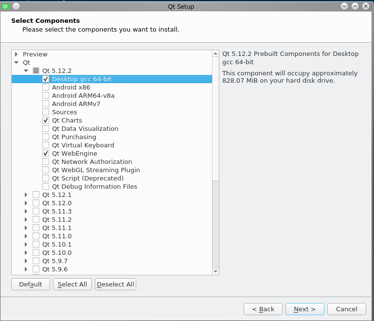

Building Aseba
==============

Requierements & Dependencies
----------------------------

Aseba requires a C++17 compatible compiler. We recommend ``GCC 8``,
``Clang 8`` or ``MSVC 19`` (Visual Studio 2019).

Aseba depends on Qt5.12 or greater. You will also need ``cmake`` 3.14 or
greater, we recommend you use the latest version available.

Getting the source code
-----------------------

The `source code of Aseba <https://github.com/mobsya/aseba>`_
is hosted on GitHub.
To fetch the source, you must first `install Git <https://git-scm.com/book/en/v2/Getting-Started-Installing-Git>`_
.

Then, to clone aseba, execute:

::

    git clone --recursive https://github.com/mobsya/aseba.git
    cd aseba

When pulling, it might be necessary to update the submodules with ``git submodule update --init``.
Alternatively, git can do that for you if you configure it with ``git config --global submodule.recurse true``.

All the commands given in the rest of this document assume the current path is the root folder of the cloned repository.

Getting all web base software
----------------------------

- Download `https://github.com/Mobsya/scratch-gui/releases/` latest release and extract it into the main directory with the name ``scratch``
- Download `https://github.com/Mobsya/thymio-blockly-standalone/releases` latest release and extract it into the main directory with the name ``thymio_blockly``
- Download `https://github.com/Mobsya/ci-data/releases/download/data/vpl3-thymio-suite.tar.gz` and extract it into the main directory with the name ``tvpl3-thymio-suite``.
 
Getting Started on Windows with MSVC
------------------------------------

Aseba Builds on Windows Seven SP1 or greater.

Download and install the following components:

.. csv-table::
   :header: "Dep", "Dowload", "Notes"

   "Visual Studio 2019 (16.2+)", "`Download <https://visualstudio.microsoft.com/downloads/>`_", Install the "Desktop development with C++" workload and the MSVC v142 - VS 2019 C++ x64/x86 Build Tools (v14.25)
   "Cmake 3.14+", `Website <https://cmake.org/download/>`__, Make sure the version of boost you choose is compatible with the cmake version
   "Qt 5.12+",   `Installer <https://download.qt.io/official_releases/online_installers/qt-unified-windows-x86-online.exe>`_, Install the MSVC 2017 binaries as well as the ``Qt WebEngine`` and ``Qt Charts`` components. For ``x86`` you can choose the ``MSVC 2015 32 bits`` binaries instead in the Qt installer components screen.
   Node & Npm, "`Download <https://nodejs.org/en/download/>`_", ``npm.exe`` must be in the path
   7Zip, "`Download <https://www.7-zip.org/download.html>`_"
   NSIS 2, "`Download <https://nsis.sourceforge.io/Download>`_", For building the installer; ``nsis.exe`` must be in the path;
   Python, "`Download <https://www.python.org/downloads/windows/>`_", For signing the installer; ``python.exe`` must be in the path;

To build Aseba, you first need to generate a Visual Studio Solution.

To do so:

1. Launch ``Developer Command Prompt for VS 2019``

   Navigate to the directory in which you want to build aseba. It is recommended not to build in the source directory

2. `Clone VCPKG <https://github.com/Mobsya/vcpkg>`_ from the Mobsya repository and install it runing ``.\bootstrap-vcpkg.bat`` and navigate to VCPKG directory

3. Install the required packages ``vcpkg install @<ASEBA_SOURCE_DIRECTORY>\vcpkg-list.txt --triplet x64-windows-static``.
Or run ``vcpkg install openssl zlib boost-signals2 boost-program-options boost-filesystem boost-scope-exit boost-asio boost-uuid boost-asio boost-date-time boost-thread boost-beast boost-interprocess --triplet x64-windows-static`` if previous is not working.
This might take a while. Replace `x64` by `x86` if you target a 32 buits build.

4. To build for x64:

::

   cmake -G"Visual Studio 16 2019" -A x64 -T version=14.25 -DBUILD_SHARED_LIBS=OFF "-DCMAKE_PREFIX_PATH=C:\<QT_INSTALLATION_PATH>\<QT_VERTION>\msvc2017_64;" -DCMAKE_TOOLCHAIN_FILE=<VCPKG_INSTALLATION_PATH>/scripts/buildsystems/vcpkg.cmake "-DVCPKG_CHAINLOAD_TOOLCHAIN_FILE=<ASEBA_SOURCE_DIRECTORY>\windows\cl-toolchain.cmake" "-DVCPKG_TARGET_TRIPLET=x64-windows-static" <ASEBA_SOURCE_DIRECTORY>

where

- ``<QT_INSTALLATION_PATH>`` is the path where Qt is installed.
- ``<QT_VERTION>`` is the version of Qt you installed. A folder of that name exists in the Qt installation directory.
- ``<ASEBA_SOURCE_DIRECTORY>`` is the directory containing the aseba repository.
- ``<VCPKG_INSTALLATION_PATH>`` is the path where Qt is cloned.

To build for x86:

::

   cmake -G"Visual Studio 16 2019" -A Win32 -T version=14.25 -DBUILD_SHARED_LIBS=OFF "-DCMAKE_PREFIX_PATH=C:\<QT_INSTALLATION_PATH>\<QT_VERTION>\msvc2017;" -DCMAKE_TOOLCHAIN_FILE=<VCPKG_INSTALLATION_PATH>/scripts/buildsystems/vcpkg.cmake "-DVCPKG_CHAINLOAD_TOOLCHAIN_FILE=<ASEBA_SOURCE_DIRECTORY>\windows\cl-toolchain.cmake" "-DVCPKG_TARGET_TRIPLET=x86-windows-static" <ASEBA_SOURCE_DIRECTORY>

Then, to build the project, you can either run ``msbuild ThymioSuite.sln`` or open ``ThymioSuite.sln`` with Visual Studio 2019.
Refer to the documentation of msbuild and Visual Studio for more informations.

Getting Started on OSX
----------------------

You will need OSX 10.11 or greater

-  Install `Homebrew <https://brew.sh/>`__.
-  In the cloned repository run

::

   brew update brew tap homebrew/bundle brew bundle

Then you can create a build directory and build Aseba

::

    mkdir build && cd build
    cmake -DCMAKE_BUILD_TYPE=Release -DBUILD_SHARED_LIBS=OFF ..
    make

Getting Started on Linux
------------------------

Dependencies On Ubuntu & Debian
~~~~~~~~~~~~~~~~~~~~~~~~~~~~~~~

You will need a C++17 able compiler. GCC 8 is known to work.
The requireded dependency may vary accros distributions.
The following instructions are given for Ubuntu 18.10 cosmic

Install the following packages:

::

    sudo apt-get install
        mesa-common-dev libgl1-mesa-dev \
        clang clang-format g++-multilib gdb \
        git \
        cmake \
        ninja-build \
        libavahi-compat-libdnssd-dev \
        libudev-dev \
        libssl-dev \
        libfreetype6 \
        libfontconfig \
        libnss3 libasound2 libxtst6 libxrender1 libxi6 libxcursor1 libxcomposite1

`Download Qt 5.12 <https://www.qt.io/download-qt-installer>`__

You will need to select the QtWebEngine, QtCharts components.

You then need to define an environment variable CMAKE_PREFIX_PATH pointing
to the Qt installation folder:

::

    export CMAKE_PREFIX_PATH=<Qt_Install_Directory/<version>/gcc_64>

Docker Image
~~~~~~~~~~~~

We also provide a docker image `Docker Image <https://hub.docker.com/r/mobsya/linux-dev-env>`__
with the dependencies already installed.

Building Aseba
~~~~~~~~~~~~~~
::

    mkdir build && cd build
    cmake  -DMOBSYA_WEBAPPS_ROOT_DIR=share/ -DCMAKE_BUILD_TYPE=Release -DBUILD_SHARED_LIBS=OFF ..
    make

A note about permissions
~~~~~~~~~~~~~~~~~~~~~~~~

If you will be connecting to your robot through a serial port, you might
need to add yourself to the group that has permission for that port. In
many distributions, this is the "dialout" group and you can add yourself
to that group and use the associated permissions by running the
following commands:

::

    sudo usermod -a -G dialout $USER
    newgrp dialout

Getting Started on Android
--------------------------
VPL 2 can be built for Android. Other tools such as studio, playground, and the old VPL
are not compatible with Android.

To build the Android version you will need:
 * `The Android tools for your system <https://developer.android.com/studio/index.html#downloads>`_
 * `The Android NDK <https://developer.android.com/ndk/downloads/index.html>`_ - tested with version 10 - currently not compatible with newer NDK
 * Qt 5.10 for Android - which you can install through the Qt installer
 * CMake 3.7 or greater

Building VPL 2
~~~~~~~~~~~~~~
First, you need to prepare some environment variables

::

    export ANDROID_SDK=<path_of_the_android_sdk>
    export ANDROID_NDK=<path_of_the_android_ndk>
    export CMAKE_PREFIX_PATH="${CMAKE_PREFIX_PATH}:$HOME/<path_of_qt5_for_android>"

Then you can build vpl2 with cmake. An APK will be generated in ``build/bin``

::

    mkdir build && cd build
    cmake -DCMAKE_BUILD_TYPE=Release -DANDROID_NATIVE_API_LEVEL=14 -DANDROID_STL=gnustl_shared -DCMAKE_TOOLCHAIN_FILE=`pwd`/../android/qt-android-cmake/toolchain/android.toolchain.cmake
    make

Getting Started on iOS
--------------------------

Require a recent version of Xcode and QT. Building the output require xcode to sign the binary.
You'll also need to be able to build part of the project for macOS. installing the brew bundle is also advised.

::

    brew update brew tap homebrew/bundle brew bundle

Generic commands

::

    mkdir build
    cd build
    export QTDIR=<YOUR_BASE_QT_DIR>

Building Thymio Suite lanncher. This require to generate the xcode project, and use it via xcodebuild command line.

::

    cmake -DIOS_ARCH="arm64" -DENABLE_BITCODE=NO -DIOS_DEPLOYMENT_TARGET=11.0 -DCMAKE_TOOLCHAIN_FILE=./ios/ios-cmake/ios.toolchain.cmake -DCMAKE_PREFIX_PATH="${QTDIR}/ios" -G Xcode -DIOS_ARCHIVE_BUILD=1 ..

Building and archiving the build

::

    xcodebuild -scheme thymio-launcher  -configuration Release -derivedDataPath ./bin/datas/libraries   -sdk iphoneos clean archive -archivePath ./bin/launcher.xcarchive -IPHONEOS_DEPLOYMENT_TARGET=11.0

Generation the IPA

::

    xcodebuild -exportArchive -archivePath ./bin/launcher.xcarchive -exportOptionsPlist ../ios/exportOptions.plist -exportPath ./bin/storebuild -allowProvisioningUpdates

Note that to generate the IPA without error you'll need to have the Provisioning profile  and the related certificate installed.

Provisioning profile
You must have at least one valid provisioning profile installed in `~/Library/MobileDevice/Provisioning Profiles`. The codesign process will look in this folder for a valid one.

::

    mv <valid_provisioining_profile> ~/Library/MobileDevice/Provisioning\ Profiles

Installing the certificate :

if `error: exportArchive: No valid Apple Distribution certificate found.`
Allows the code sign process to access a certificate and import the new certificate

::

    security unlock-keychain -p <user_keychain_access_password>
    security import <Certificate_p12_path> -k ~/Library/Keychains/login.keychain -P <certificate_p12_password> -T /usr/bin/codesign

Running tests
~~~~~~~~~~~~~

Once the build is complete, you can run ``ctest`` in the build directory
to run the tests.

Ninja
~~~~~

The compilation of Aseba can be significantly speedup using ``ninja``
instead of make. Refer to the documentation of ``cmake`` and ``ninja``.
